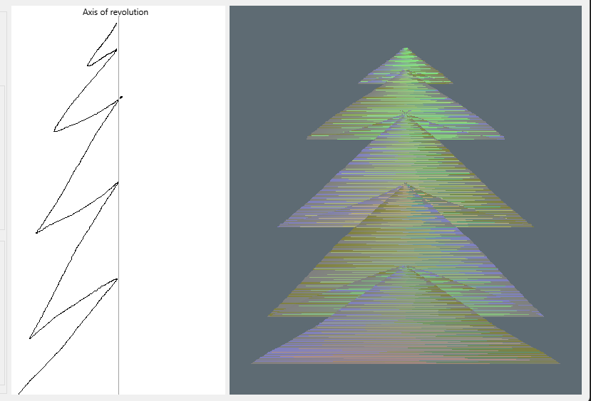

# 2D Line Circular Extrusion
## Author
Andrei Bîgiu

## Description
Submission for the famous Computer Graphics Contest. To open the application, please consult the _INSTALL.md_ file

The application is extruding and revolving a 2D line provided by the user, into a 3D object that can be rotated and scaled.

It was built using the user interface provided for OpenGL Lab 1. 

## Usage
The user can interact with multiple items of the application:
### Transformation menu
Using the transformation menu, the user can use the knobs to rotate the object around an axis (X, Y or Z), or to scale the object.

 

### Number of edges selector
The user can select how many edges the object should have, thus increasing the resolution of the generated object. The program will calculate the angular spacing between nodes by dividing 360 by that number. In this way, the resolution of the object can be modified, with a minimum of 2 edges (resulting in a 2D images/image) and 60 edges (resulting in nodes spaced 6 degrees apart).

*Selector for the number of edges*

*2 edges selected*

*10 edges selected*

*60 edges selected*

### Canvas
The canvas is the main point of interaction between the user and the application. Here, the user can draw a single, continuous curve, that will serve as the input for the algorithm, using the left-click button and the movement of the mouse. Upon releasing the left-click button, the entry is saved in memory. The current drawing is erased when a new one is started, so a finished drawing can not be modified. 

*A curve drawn on canvas*

#### Axis of revolution
The axis is the point used as the origin when revolving the curve, thus, points closer to the line are closer to the core of the object. When a curve intersects this axis, the resulting surface will "cut" the object at that point, resulting in interesting patterns. The method of intersecting the axis of revolution can simulate multiple tangent objects being generated.

*Multiple points intersecting the axis of revolution*

*No points intersecting the axis of revolution*

### Generate!
Once the line is drawn, and the number of edges selected, the user can press "Generate" and the generated object will appear on the right panel of the application.

*The generate button*

## Algorithm

### Input processing
The application will collect the coordinates of the mouse while the left-click button is pressed on the canvas.
Then, those points are mapped from the canvas space [0, 500] to world space [-1,1], so they can be further processed.

### Points generating
After mapping the points to the correct space, each vertex is selected, and an array of new vertices is constructed by rotating the vertex in space, in increments of 360 degrees divided by the number of faces desired.

### Surface creation
To create a surface, the points need to be added in the correct order in the vertex buffer. 

After input processing and generation, the array is holding n different "rings" of points. To create a face between the rings, points from both rings need to be used.
To figure out the points needed for each triangle, a list of all possible triangles containing a point P was constructed. After removing the symmetries, we concluded that each point is part of two unique triangles, so the final list of vertices is twice the size of the original "rings" one. The exact points of the triangle are gathered by shifting the index of P by the length of the ring (360 divided by the number of faces + 1, as the first vertex is included twice to complete the loop).

Finally, the vertex buffer is updated with the new values.

### Colors
The polygons can be easily spotted on the object, due to the color difference. The color is calculated per polygon (rectangle), by averaging the normals of its two triangles.

Polygon color pattern example*

## Future development
The project can be further improved in many ways, and its practicality can be increased. Below are the features that can be added:
- add texture support
- add illumination and shading
- export options for the mesh

## Examples

*An object similar to a martini glass*

*A Hut*

*A vase*

*An hourglass*

*2D texture of a pine tree*

*A spinning top toy*